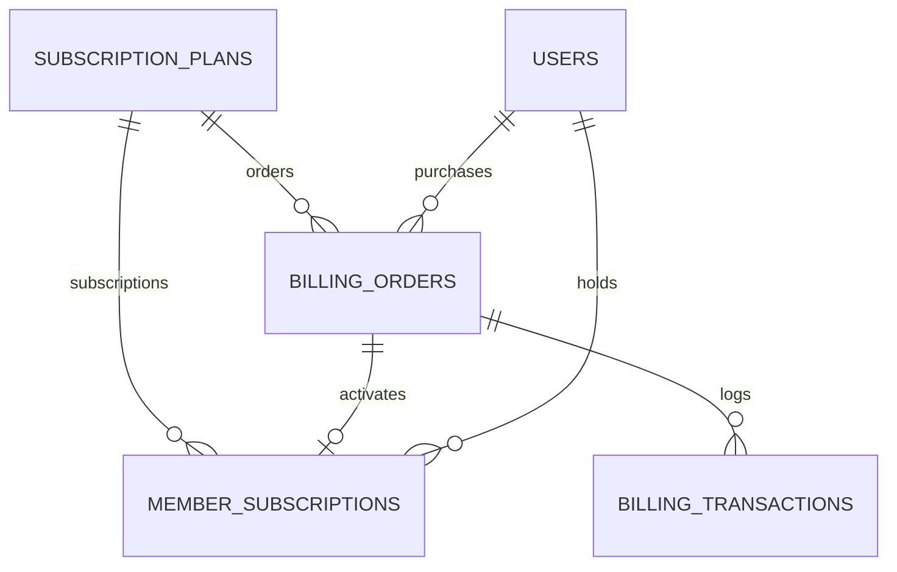

# Developer Guide: Paid Subscriptions & Billing in MYADS

## 1. Purpose & Overview

The Paid Subscriptions & Billing System provides an optional, modular monetization layer for the MYADS platform.

### Administrator Capabilities:
- Enable or disable the billing system globally from `/admin/billing/settings`.
- Create and manage tiered subscription plans (`/admin/billing/plans`).
- Manage multiple billing currencies, exchange rates, and decimal precision (`/admin/billing/currencies`).
- Configure credentials and environments for 8 supported payment gateways (`/admin/billing/gateways`).
- Review and approve/reject manual bank transfer orders with transaction notes (`/admin/billing/orders`).
- Monitor real-time transaction ledger logs (`/admin/billing/transactions`).

### Member Capabilities:
- Browse available subscription plans with dynamic currency conversion on `/plans`.
- View active, queued, or expired subscription history on `/settings/billing`.
- Complete purchases via secure external hosted checkout flows or bank transfer receipt upload.
- Enjoy automatic entitlements (exclusive profile badge, bonus points, free advertising credits, and promotional discounts).

---

## 2. Supported Payment Gateways

| Gateway | Integration Mode | Supported Currencies / Features |
| :--- | :--- | :--- |
| **Stripe** | Hosted Checkout Session | Global currencies (USD, EUR, GBP, etc.) with webhook sync. |
| **PayPal** | Hosted Order Flow | Global PayPal supported currencies with IPN/Webhook. |
| **Bank Transfer** | Manual Receipt Flow | Plain-text bank transfer instructions + receipt image upload. |
| **Lemon Squeezy** | Hosted Checkout | Global SaaS merchant of record checkout with signature verification. |
| **Paddle** | Hosted Checkout | Global checkout with overlay / redirect support. |
| **Tabby** (Beta) | Buy Now Pay Later | UAE (AED) & Saudi Arabia (SAR) local currencies with phone validation. |
| **Flouci** (Beta) | Mobile Wallet & Gateway | Tunisia (TND) with 3-decimal precision (millimes conversion). |
| **Apple Pay** | High-Fidelity Simulation | FaceID double-click modal sheet simulation for mobile testing (`USD`, `EUR`, `AED`, `SAR`). |

---

## 3. Core Architecture & File Structure

### 3.1 Controllers
- `app/Http/Controllers/BillingController.php` — Frontend member checkout, order display, and webhook handlers.
- `app/Http/Controllers/AdminBillingController.php` — Administrator plan, currency, order review, and gateway settings.

### 3.2 Models
- `app/Models/SubscriptionPlan.php` — Plan definitions, pricing, duration, and entitlements.
- `app/Models/MemberSubscription.php` — User subscription records with lifecycle states (`active`, `queued`, `expired`, `cancelled`, `rejected`).
- `app/Models/BillingOrder.php` — Purchase orders, status snapshots, gateway checkout references, and receipt metadata.
- `app/Models/BillingTransaction.php` — Granular transaction events log.
- `app/Models/BillingCurrency.php` — Currency records, exchange rates, and symbols.

### 3.3 Services
- `app/Services/Billing/BillingGatewayRegistry.php` — Central registry for payment providers.
- `app/Services/Billing/BillingCurrencyService.php` — Currency formatting, rate conversions, and active currency resolution.
- `app/Services/Billing/SubscriptionPlanService.php` — Plan CRUD, entitlement defaults, and normalization.
- `app/Services/Billing/SubscriptionLifecycleService.php` — Subscription activation, queuing, extension, and completion logic.
- `app/Services/Billing/SubscriptionEntitlementService.php` — Active badge resolution, bonus point injection, and ad credit provisioning.

### 3.4 Gateway Implementations (`app/Services/Billing/Gateways/`)
- `BillingGatewayInterface.php` & `AbstractBillingGateway.php`
- `StripeGateway.php`
- `PayPalGateway.php`
- `BankTransferGateway.php`
- `LemonSqueezyGateway.php`
- `PaddleGateway.php`
- `TabbyGateway.php`
- `FlouciGateway.php`
- `ApplePayGateway.php`

---

## 4. Database Schema Overview

### Key Tables:
1. `subscription_plans`: `name`, `duration_days`, `is_lifetime`, `base_price`, `is_featured`, `is_active`, `accent_color`, `recommended_text`, `marketing_bullets`, `entitlements`.
2. `billing_currencies`: `code`, `name`, `symbol`, `exchange_rate`, `decimal_places`, `is_active`, `is_base`.
3. `billing_orders`: `order_number`, `user_id`, `subscription_plan_id`, `gateway`, `status`, `base_currency_code`, `currency_code`, `base_amount`, `display_amount`, `gateway_reference`, `receipt_path`.
4. `member_subscriptions`: `user_id`, `subscription_plan_id`, `status`, `starts_at`, `ends_at`, `activated_at`, `entitlements_snapshot`.
5. `billing_transactions`: `billing_order_id`, `user_id`, `gateway`, `transaction_type`, `status`, `external_transaction_id`, `amount`, `currency_code`.

---

## 5. Subscription Lifecycle & Entitlements

### 5.1 Lifecycle Rules
- **No Active Plan:** Purchasing a plan immediately creates an `active` subscription starting at `now()`.
- **Same Plan Renewal:** Purchasing the currently active plan automatically extends the existing `ends_at` expiration date.
- **Different Plan Upgrade:** Purchasing a different tier creates a `queued` subscription that automatically activates once the current plan reaches expiration.

### 5.2 Entitlements Engine
When a subscription becomes `active`, the following entitlements are processed:

| Entitlement Key | Effect on Member Account |
| :--- | :--- |
| `profile_badge_label` | Renders a verified glowing badge next to the username on feed and profile. |
| `profile_badge_color` | Custom hex color for the profile badge. |
| `bonus_pts` | Instant PTS credit credited to user's point ledger. |
| `bonus_nvu` | Direct addition of Visit Exchange view credits (`users.nvu`). |
| `bonus_nlink` | Direct addition of Text/Link ad click credits (`users.nlink`). |
| `bonus_nsmart` | Direct addition of Smart Ad impression credits (`users.nsmart`). |
| `status_promotion_discount_pct` | Automatic percentage discount applied during community post promotions. |

---

## 6. Security & Payment Data Privacy

- **Zero Card Storage:** MYADS never accepts, processes, or stores credit card numbers or sensitive CVV codes. All payments use externally hosted checkout sessions or secure redirect flows.
- **Encrypted Secrets:** Gateway API keys, client secrets, and webhook tokens are encrypted at rest via `Illuminate\Support\Facades\Crypt`.
- **Masked Credentials:** Sensitive credentials in `/admin/billing/gateways` are masked in the UI.
- **Receipt Upload Security:** Bank transfer receipt images are strictly validated:
  - Allowed MIME types: `image/jpeg`, `image/png`, `image/webp`.
  - Maximum upload size: `4096 KB` (4 MB).
  - Stored in isolated path: `public/upload/billing/receipts/`.
- **CSRF Protection:** Webhook routes (`POST /billing/webhook/{gateway}`) are exempted from CSRF verification and protected by cryptographic webhook signature headers.

---

## 7. How to Implement a Custom Gateway

To add a new payment provider:

1. Create `app/Services/Billing/Gateways/CustomGateway.php` extending `AbstractBillingGateway` and implementing `BillingGatewayInterface`.
2. Implement required contract methods:
   - `key()`, `label()`, `supportsCurrency()`
   - `createCheckout()`, `handleReturn()`, `handleWebhook()`
   - `normalizeTransaction()`, `maskConfig()`
3. Register the gateway in `BillingGatewayRegistry::all()`.
4. Define configuration keys in `SubscriptionGatewaySettings::DEFAULTS` and secret fields in `SubscriptionGatewaySettings::SECRET_FIELDS`.
5. Add admin form fields to `admin_themes/default/views/admin/billing/gateways.blade.php`.
6. Synchronize translation keys across all supported language packs (`lang/*/messages.php`).
