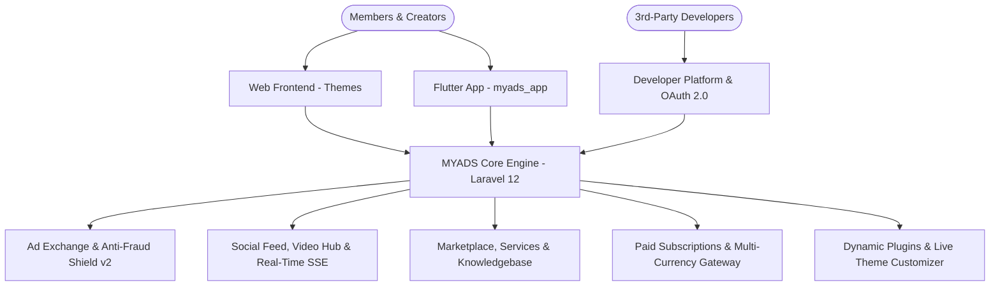

# MYADS — Manual & Platform Overview

Welcome to the official documentation for **MYADS**!

MYADS is an enterprise-grade social networking and advertising exchange platform designed for website owners, creators, and digital communities. Built from the ground up on **Laravel 12 (PHP 8.2+)**, MYADS combines high-throughput ad serving, real-time community engagement, a digital marketplace, developer APIs, and a native Flutter mobile app into a single unified ecosystem.

---

## 1. Core Platform Architecture & Features

### 1.1 Advertising Exchange & Anti-Fraud Shield v2
- **Banner Ads:** Multi-dimension image banners (728x90, 300x250, 160x600, 468x60) with embed code generators.
- **Text & Link Ads:** Contextual text links and referral ads.
- **Visit Exchange:** Surf-to-earn traffic exchange with countdown validation.
- **YouTube Views Exchange:** Watch-to-earn promotion for YouTube videos.
- **Smart Ads:** Contextual native widgets embeddable on external blogs and websites.
- **Custom Member Ads:** Direct peer-to-peer advertising deals between publishers and advertisers with daily automated PTS settlements.
- **Anti-Fraud Shield v2 (`ADS-05`):** Adheres to the **IAB Viewability Standard** (>= 50% visibility for >= 1 continuous second), client-side **Human Behavior Fingerprinting** (`mousemove` velocity, touch tap duration, visibility state, headless bot detection), asynchronous viewability beacons, and reason-tagged impression protection.

### 1.2 Social Networking & Real-Time Engine
- **Community Feed:** Timeline supporting text, multi-image galleries, link preview metadata scraping, quote reposts, @mentions, and hashtags.
- **Real-Time Live Events Engine (`RT-04`):** Server-Sent Events (SSE) streaming (`/live/stream`) delivering instant unread notification and message badge count updates without server polling.
- **Video Hub (`/video`) & Shorts (`/clips`):** YouTube-style video catalog, Spotlight Hero video, category filter pills, 9:16 vertical Clips with native swipe gestures, floating Mini Picture-in-Picture (PIP) player, and Continuous Audio Player bar.
- **Forum & Topics:** Moderated discussion categories with sticky topics, locking, and attachments.
- **Gamification:** Points (PTS), achievement badges, daily quests, and point transaction ledgers.

### 1.3 Digital Marketplace & Services
- **Product Store:** Downloadable scripts, themes, and plugins priced in PTS or real currency.
- **Wiki Knowledgebase:** Structured product documentation with Markdown formatting and categorization.
- **Services Marketplace:** Service request bidding, milestone tracking, escrow delivery workflow, and reviews.

### 1.4 Paid Subscriptions & Multi-Currency Billing
- **Flexible Subscription Plans:** Tiered membership levels with automatic entitlements (glowing profile badges, bonus points, free advertising credits, and post promotion discounts).
- **8 Integrated Payment Gateways:** Stripe, PayPal, Bank Transfer (with receipt image verification), Lemon Squeezy, Paddle, Tabby (BNPL), Flouci, and Apple Pay simulation.
- **Multi-Currency Engine:** Configurable exchange rates, decimal precision, and base currency options.

### 1.5 Developer Platform & OAuth 2.0 Ecosystem
- **Developer Hub (`/developer`):** Register 3rd-party apps, manage client credentials, and review scopes.
- **OAuth 2.0 & Developer API v1:** 27 granular scopes across 7 categories (`Identity`, `Content`, `Messages`, `Wallet`, `Community`, `Store`, `Owner Integrations`).
- **External Web Share API (`/share`):** Seamless one-click post sharing from external websites.

### 1.6 Dynamic Extensibility & Customization
- **Dynamic Plugin Architecture:** Zero-hardcoding dynamic plugin discovery (`/plugins`) with hook and filter engine (`add_filter`, `add_action`).
- **Rich Text Editor Engine:** Extensible WYSIWYG editor framework supporting Quill and TinyMCE 7 (`myads-tinymce-editor`).
- **Live Theme Customizer (`THEME-07`):** Visual color, typography, surface, and glassmorphism customizer at `/admin/themes/customizer` with live responsive split-screen preview.

### 1.7 Administration & High-Performance Security
- **Duralux Admin Dashboard (`/admin`):** Modern dark-mode interface, real-time System Health diagnostics, and dynamic Admin Advice Engine.
- **Database Optimization & Micro-Caching:** Compound database indexes for high-traffic paths and in-memory candidate micro-caching reducing query load by >80%.
- **Safe Maintenance Center:** 503 maintenance mode with IP Whitelist and emergency secret bypass token.
- **Media Manager & Database Cleanup:** Storage monitoring, log pruning, and media file optimization.

---

## 2. Documentation Directory

For complete setup, configuration, and developer guides, consult the dedicated manuals below:

| Guide | Description |
| :--- | :--- |
| 📖 [**Installation Guide**](INSTALLATION.md) | Step-by-step setup using the visual web wizard or CLI. |
| ⚙️ [**System Requirements**](SYSTEM_REQUIREMENTS.md) | Server, PHP, database, SSE, and reverse proxy specifications. |
| 🎨 [**Theme Guide**](THEME_GUIDE.md) | Creating themes, Blade templating, and Live Theme Customizer. |
| 🔌 [**Plugin Guide**](PLUGIN_GUIDE.md) | Building plugins, registering hooks, widgets, and custom editors. |
| 📱 [**Mobile App Guide**](MOBILE_APP_GUIDE.md) | Connecting and compiling the Flutter mobile client (`myads_app`). |
| 💳 [**Paid Subscriptions Guide**](PAID_SUBSCRIPTIONS_GUIDE.md) | Configuring billing, subscription tiers, and payment gateways. |
| 🗂️ [**Types & Constants Definition**](types_definition.md) | Database reference for `s_type` post types and `like.type` targets. |
| 🚀 [**Upgrade Guide**](UPGRADE.md) | Zero-downtime upgrade instructions and safety preflight checks. |
| 📡 [**REST API Documentation**](API_DOCS.md) | Comprehensive specification for Developer API v1 and Mobile API. |
| 📜 [**Changelogs & Release History**](changelogs.md) | Full version history and patch notes. |

---

## 3. Technology Stack Summary

- **Backend Framework:** Laravel 12 (PHP 8.2+)
- **Database:** MySQL 5.7+ / 8.0+ or MariaDB 10.3+ (InnoDB Engine)
- **Frontend Stack:** Bootstrap 5, Vanilla JS (AJAX / SSE), Blade Views, FontAwesome 6
- **Mobile Client:** Flutter 3.27+ (Dart, Riverpod, Dio)
- **Authentication:** Laravel Auth, Sanctum (Mobile API), OAuth 2.0 (Developer Platform)
