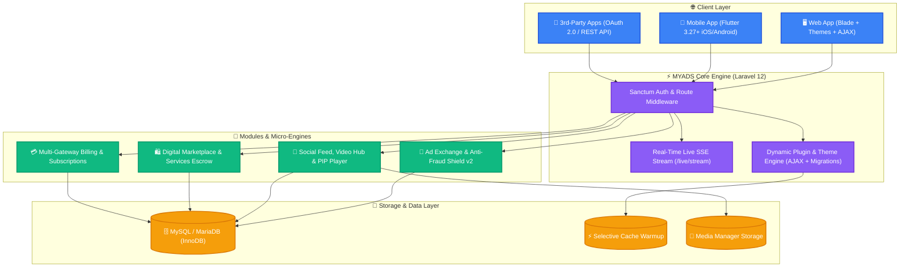

<div align="center">

# 🚀 MYADS v4.5.6

### The Ultimate Open-Source Social Network, Traffic & Ad Exchange Platform

**Empower your digital community with cutting-edge social engagement, peer-to-peer ad exchange, YouTube-style video hub & clips, a multi-vendor digital marketplace, and a first-party native Flutter mobile app.**

Built with passion on **Laravel 12**, **PHP 8.2+**, and **Bootstrap 5 / Flutter**.

---

[](https://github.com/mrghozzi/myads/releases)
[](https://laravel.com)
[](https://php.net)
[](https://github.com/mrghozzi/myads_app)
[](LICENSE)

[](https://ko-fi.com/mrghozzi)
[](https://www.patreon.com/MrGhozzi)
[](https://github.com/mrghozzi/myads/stargazers)
[](https://github.com/mrghozzi/myads/network/members)

<br/>

<a href="#-key-features"><strong>Explore Features</strong></a> •
<a href="#-quick-start--installation"><strong>Quick Start</strong></a> •
<a href="#-official-flutter-mobile-app"><strong>Mobile App</strong></a> •
<a href="#-developer-platform--rest-api"><strong>Developer API</strong></a> •
<a href="Documents/README.md"><strong>Documentation</strong></a> •
<a href="#-community--support"><strong>Support</strong></a>

<br/><br/>


</div>

---

## 🌟 Why Choose MYADS?

MYADS is an enterprise-ready, all-in-one ecosystem that eliminates the need for dozens of disjointed scripts or subscription services. It unifies high-throughput advertising exchange, real-time social networking, video streaming, digital commerce, and developer APIs under a modern, highly optimized Laravel 12 architecture.

<table>
  <tr>
    <td width="50%">
      <h3>📢 Monetization & Ad Network</h3>
      <p>Banner ads, text links, surf traffic exchange, YouTube views exchange, Smart Ads, and peer-to-peer custom ad deals with daily PTS settlements and fraud protection.</p>
    </td>
    <td width="50%">
      <h3>📺 Video Hub & Shorts Clips</h3>
      <p>YouTube-inspired video platform with Spotlight Hero, 16:9 grid, floating Picture-in-Picture (PIP) mini-player, and 9:16 vertical Shorts with touch swipe gestures.</p>
    </td>
  </tr>
  <tr>
    <td width="50%">
      <h3>💬 Next-Gen Social Community</h3>
      <p>N+1 optimized timeline feed with multimedia posts (Video, Audio, Music, Files, Clips), reactions, reposts, mentions, forums, and SSE real-time notifications.</p>
    </td>
    <td width="50%">
      <h3>📱 Native Flutter Mobile App</h3>
      <p>First-party Android & iOS client (<code>myads_app</code>) featuring 100% feed parity, Clips reels, Hexagon publisher avatars, and 14-language internationalization.</p>
    </td>
  </tr>
  <tr>
    <td width="50%">
      <h3>🛍️ Digital Store & Freelance Services</h3>
      <p>Digital marketplace for scripts, plugins, and themes with PTS pricing, wiki-style documentation per product, and a full freelance services bidding marketplace.</p>
    </td>
    <td width="50%">
      <h3>⚡ Superdesign Admin & Extensibility</h3>
      <p>Duralux dark-mode admin suite with single-pass SQL aggregations (95%+ faster load), zero-reload AJAX plugin & theme management, and live theme customizer.</p>
    </td>
  </tr>
</table>

---

## 🏗️ System Architecture



---

## ✨ Key Features

### 📢 1. Advertising Exchange & Anti-Fraud Shield v2
- **Multi-Format Ads:** Standard image banners (728x90, 300x250, 160x600, 468x60), text links, native cards, and embeddable JavaScript widgets.
- **Traffic Exchange (Surf-to-Earn):** High-traffic surf bar with countdown timer, anti-cheat validation, and instant PTS rewards.
- **YouTube Views Exchange:** Watch-to-earn exchange engine boosting real views and engagement for video creators.
- **Custom Member Ads (`/ads/custom`):** Direct peer-to-peer ad marketplace. Publishers generate embed scripts (`/embed/custom.js`), negotiate deals, and receive automated daily PTS payouts.
- **Smart Ads with Geo-Targeting & A/B Testing:** Dynamic contextual ads tailored by country, device, and performance metrics with hourly click heatmaps.
- **Anti-Fraud Shield v2 (`ADS-05`):**
  - Compliant with **IAB Viewability Standards** (requires ≥ 50% viewport visibility for ≥ 1 continuous second).
  - Real-time **Human Behavior Fingerprinting** (`mousemove` trajectory velocity, mobile touch tap duration, headless browser detection via `navigator.webdriver`, and WebGL checks).
  - Rate limiting (24h per anonymous fingerprint) and reason-tagged impression protection (`RAPID_CLICK`, `BOT_FINGERPRINT`, `HIDDEN_TAB`, `DWELL_TOO_SHORT`).

### 📺 2. YouTube-Style Video Hub & Shorts Engine
- **Dedicated Video Hub (`/video`):** Sleek YouTube-inspired interface featuring a Spotlight Hero card, category filter pills (`All`, `Videos`, `Shorts Clips`, `Trending`, `Latest`), and a responsive 16:9 video grid.
- **Dedicated Watch Page (`/t{id}`):** Custom HTML5 player, suggested videos sidebar, Hexagon publisher avatars, and standalone popovers.
- **Mini Floating Picture-in-Picture (PIP) Player:** Seamlessly transitions playing videos into a floating corner player when users scroll down the page, preserving playback state.
- **Shorts Clips Engine (`/clips`):** 9:16 vertical video reels with native touch swipe gestures (`touchstart`/`touchend`), mouse wheel scrolling, and original audio disc animation (`messages.original_audio`).
- **Continuous Audio Player Bar:** Persistent bottom player with HTML5 waveform visualization and `sessionStorage` playback memory across page transitions.

### 💬 3. Next-Gen Social Networking & Real-Time Engine
- **High-Performance Feed:** Zero N+1 query overhead, supporting rich multimedia attachments (Video, Audio, Music, Image Galleries, Files, and Clips).
- **Rich Text Editor Suite:** Seamless switching between **Quill.js v1.3.7** and **TinyMCE 7** (via plugin) with dark-mode parity and AJAX drag-and-drop image uploads.
- **Real-Time Live Events Engine (`RT-04`):** Server-Sent Events (SSE) streaming (`/live/stream`) delivering instant message badges, notification toasts, and live community activity without battery-draining polling.
- **Comprehensive Interactions:** Reactions, quote reposts, nested comments, `@mentions`, and hashtag filtering.
- **Full-Featured Forum:** Categorized discussion boards, sticky topics, thread locking, moderation roles, and attachments.
- **Gamification & Rewards:** 25+ dynamic unlockable achievement badges (Video Star, Clips Master, Audio Maestro), PTS direct transfers, voucher codes, and daily/weekly quests.

### 🛍️ 4. Digital Store, Services Marketplace & Knowledgebase
- **Digital Products Marketplace:** Publish and sell scripts, themes, templates, and plugins with PTS or fiat pricing, download tracking, and version management.
- **Wiki-Style Knowledgebase:** Rich documentation hub per product with Markdown rendering, interactive Mermaid diagrams, category filtering, and instant search.
- **Freelance Services Marketplace:** Post custom service requests, receive structured provider offers, award milestones, and exchange verified client reviews.
- **Web Directory:** Categorized webmaster directory with SEO backlinks, thumbnail scraping, and traffic statistics.

### 💳 5. Paid Subscriptions & Multi-Currency Billing
- **Tiered Membership Plans:** Custom plan durations, recurring benefits, ad credits, discount entitlements, and glowing tier badges.
- **8 Integrated Payment Gateways:**
  - `Stripe` • `PayPal` • `Lemon Squeezy` • `Paddle` • `Bank Transfer` (with manual receipt review) • `Tabby` (BNPL) • `Flouci` • `Apple Pay simulation`.
- **Multi-Currency Engine:** Configurable base currency, live exchange-rate snapshots, and custom decimal formatting.
- **Privacy-Centric:** Zero credit card data stored locally; all transactions processed via hosted PCI-compliant gateways.

### 🛠️ 6. Developer Platform & OAuth 2.0 Ecosystem
- **OAuth 2.0 Server (`/oauth/authorize`, `/oauth/token`):** Full RFC 6749 compliance, query parameter preservation, and HTTP Basic Auth client credential support.
- **Granular Permissions Catalog:** 27 scopes across 7 security categories (`Identity`, `Content`, `Messages`, `Wallet`, `Community`, `Store`, `Owner Integrations`).
- **Developer API v1 (`/api/developer/v1/*`):** Comprehensive REST endpoints for third-party publishing, identity retrieval, and store integration.
- **Reverse Proxy & Server Resilience:** Universal Bearer token extraction supporting Apache FastCGI, cPanel, Nginx, and Cloudflare reverse proxies.
- **WordPress Integration:** Ready for third-party auto-posters and plugins (such as ADStn Auto Poster).

### 🎛️ 7. Duralux Superdesign Admin Suite
- **Modern Dark-Mode Dashboard (`/admin`):** Glassmorphic UI with single-pass SQL aggregations delivering a **95%+ reduction in load times**.
- **Admin Advice Engine:** Rotating daily expert tips ("نصيحة اليوم للمدير") to help webmasters grow and secure their platform.
- **Zero-Reload AJAX Extension Hub:** Activate or deactivate plugins and themes instantly with live category filter chips and dynamic counters.
- **Automated Database Migrations:** Plugins containing database migrations automatically execute schema updates upon activation or upgrade.
- **Live Theme Customizer (`THEME-07`):** Interactive visual customizer adjusting brand colors, typography (Inter, Cairo, Tajawal, Roboto), surface styles, and glassmorphic blur with responsive split-screen preview.
- **System Health Monitor:** Real-time diagnostics for table sizes, database index overhead (`OPTIMIZE TABLE`), plugin resource footprint, and selective cache pre-warming (`CacheWarmupService`).

---

## 📱 Official Flutter Mobile App

MYADS features a first-party, cross-platform mobile client built with **Flutter 3.27+** for Android and iOS.

<div align="center">
  <a href="https://github.com/mrghozzi/myads_app">
    
  </a>
</div>

### Mobile Highlights:
- **Feed & Multimedia:** Full parity with the web social feed — 16:9 videos, vertical Clips player, audio cards with waveform visualization, image grids, and file attachments.
- **Video Hub Screen:** Dedicated YouTube-styled video screen with filter pills, Spotlight Hero, and Shorts shelf.
- **Premium Member Profiles:** Vertical Hexagon avatars with dynamic tier border colors matching the web theme, earned badges, and parallax headers.
- **Security & Privacy:** Hardware-backed encrypted keystore storage (`flutter_secure_storage`), Sanctum Bearer token validation, HTTPS enforcement, and member ID anti-enumeration.
- **Global Localization:** Native Arabic (RTL) and English support with automatic device locale synchronization.

> 📖 Check out the complete [Mobile App Guide](Documents/MOBILE_APP_GUIDE.md) and [Mobile Repository](https://github.com/mrghozzi/myads_app).

---

## 💻 Technology Stack

| Layer | Technology |
| :--- | :--- |
| **Backend Framework** | [Laravel 12.x](https://laravel.com/) |
| **PHP Runtime** | PHP 8.2 or higher (PHP 8.3 & 8.4 ready) |
| **Database Engine** | MySQL 5.7+ / 8.0+ or MariaDB 10.3+ (InnoDB) |
| **Web Frontend** | Blade Templates, Bootstrap 5, Vanilla JavaScript (Zero SPA overhead) |
| **Mobile Client** | [Flutter 3.27+](https://flutter.dev/) / Dart (Riverpod, Dio, SecureStorage) |
| **Real-Time Streaming**| Server-Sent Events (SSE) via `LiveEventStreamService` |
| **API & Auth** | Laravel Sanctum (Mobile), OAuth 2.0 (Developer Platform), Socialite (OAuth) |
| **Testing Suite** | PHPUnit 11 (Automated feature & unit test coverage) |
| **Internationalization**| 14 Locales (`ar`, `en`, `fr`, `es`, `de`, `it`, `pt`, `ru`, `sr`, `tr`, `ja`, `zh_CN`, `zh_TW`, `fa`) |

---

## ⚡ Quick Start & Installation

### Prerequisites
Before installing MYADS, ensure your server meets the following requirements:
- **PHP:** `^8.2` with extensions: `BCMath`, `Ctype`, `cURL`, `DOM`, `Fileinfo`, `JSON`, `Mbstring`, `OpenSSL`, `PCRE`, `PDO MySQL`, `Tokenizer`, `XML`.
- **Database:** MySQL 5.7+ or MariaDB 10.3+
- **Tools:** Composer 2.x and Node.js 18+ (for local asset compilation)

### 1. Fast Setup (Web Installer)

1. **Clone or Download the repository:**
   ```bash
   git clone https://github.com/mrghozzi/myads.git
   cd myads
   ```

2. **Install PHP and Node dependencies:**
   ```bash
   composer install --optimize-autoloader --no-dev
   npm install && npm run build
   ```

3. **Configure Web Server:**
   - Point your web server document root to the `public/` directory.
   - For Apache on shared hosting, the pre-configured `.htaccess` in the root will automatically handle redirection.

4. **Launch the Visual Setup Wizard:**
   Open your browser and navigate to:
   ```text
   http://your-domain.com/install
   ```
   Follow the 5-step installer to verify file permissions, configure your database, generate the application key, run database migrations, and create your super-admin account.

---

### 2. Manual CLI Setup (For Developers)

```bash
# 1. Clone repository
git clone https://github.com/mrghozzi/myads.git && cd myads

# 2. Install dependencies
composer install
npm install

# 3. Configure environment
cp .env.example .env
php artisan key:generate

# 4. Configure your database credentials in .env, then migrate:
php artisan migrate --force

# 5. Build frontend assets & launch server:
npm run build
php artisan serve
```

Your MYADS instance will now be live at `http://127.0.0.1:8000`! 🎉

---

## 🔌 Developer Platform & REST API

MYADS includes an enterprise-grade REST API and OAuth 2.0 authorization server.

### Example: Publish a Community Post via REST API
```bash
curl -X POST "https://your-domain.com/api/developer/v1/me/content" \
     -H "Authorization: Bearer YOUR_ACCESS_TOKEN" \
     -H "Content-Type: application/json" \
     -H "Accept: application/json" \
     -d '{
       "content": "Excited to launch our new product on MYADS! 🚀 #innovation",
       "media_type": "text",
       "privacy": "public"
     }'
```

### Supported Scopes Overview:
- `user.identity.read` • `user.profile.read` • `user.profile.write`
- `user.content.read` • `user.content.write` (with aliases `content.write`, `posts.write`)
- `user.messages.read` • `user.messages.send`
- `user.wallet.read` • `user.community.read` • `store.products.read`

> 📖 For full API endpoints, query parameters, and code examples, consult the [API Documentation](Documents/API_DOCS.md).

---

## 📚 Complete Documentation Index

All in-depth technical manuals and guides are located in the [`Documents/`](Documents/) directory:

| Guide | Description |
| :--- | :--- |
| 📖 [**Manual & Overview**](Documents/README.md) | In-depth platform architecture and module overview. |
| ⚙️ [**Installation Guide**](Documents/INSTALLATION.md) | Detailed server installation guide for Apache, Nginx, and cPanel. |
| 📋 [**System Requirements**](Documents/SYSTEM_REQUIREMENTS.md) | Complete list of PHP extensions, database configs, and server sizing. |
| 🎨 [**Theme Guide**](Documents/THEME_GUIDE.md) | Guide to building custom Blade themes and Live Theme Customizer hooks. |
| 🔌 [**Plugin Guide**](Documents/PLUGIN_GUIDE.md) | How to build plugins, register action/filter hooks, and inject widgets. |
| 📱 [**Mobile App Guide**](Documents/MOBILE_APP_GUIDE.md) | Connecting and compiling the Flutter mobile client (`myads_app`). |
| 💳 [**Paid Subscriptions Guide**](Documents/PAID_SUBSCRIPTIONS_GUIDE.md) | Configuring subscription plans, payment gateways, and webhooks. |
| 📡 [**REST API Documentation**](Documents/API_DOCS.md) | Developer API v1, Mobile API, and OAuth 2.0 specifications. |
| 🚀 [**Upgrade Guide**](Documents/UPGRADE.md) | Safe, zero-downtime database upgrade steps across versions. |
| 📜 [**Changelog & Release Notes**](Documents/changelogs.md) | Detailed version history, patches, and security notes. |

---

## 🤝 Contributing & Community

Contributions are what make the open-source community an amazing place to learn, inspire, and create. Any contributions you make are **greatly appreciated**!

1. **Fork the Project**
2. **Create your Feature Branch** (`git checkout -b feature/AmazingFeature`)
3. **Commit your Changes** (`git commit -m 'Add some AmazingFeature'`)
4. **Push to the Branch** (`git push origin feature/AmazingFeature`)
5. **Open a Pull Request**

Please make sure to review our [Contributing Guidelines](CONTRIBUTING.md), [Code of Conduct](CODE_OF_CONDUCT.md), and [Security Policy](SECURITY.md).

---

## ⭐ Star History

If you love MYADS or find it helpful for your projects, **please give this repository a star!** ⭐  
Your support motivates continuous development and keeps the open-source spirit alive.

<div align="center">
  <a href="https://github.com/mrghozzi/myads/stargazers">
    
  </a>
</div>

---

## 💖 Sponsorship & Support

MYADS is free, open-source software maintained by **[mrghozzi](https://github.com/mrghozzi)**. If this project brings value to your business or community, consider supporting future development:

<div align="center">

[](https://ko-fi.com/mrghozzi)
&nbsp;&nbsp;&nbsp;&nbsp;
[](https://www.patreon.com/MrGhozzi)

</div>

---

## 📄 License

MYADS is released under the **[MIT License](LICENSE)**. You are free to use, modify, and distribute this software for personal and commercial projects.

<div align="center">
  <sub>Crafted with ❤️ by <a href="https://github.com/mrghozzi">mrghozzi</a> and the open-source community.</sub>
</div>
