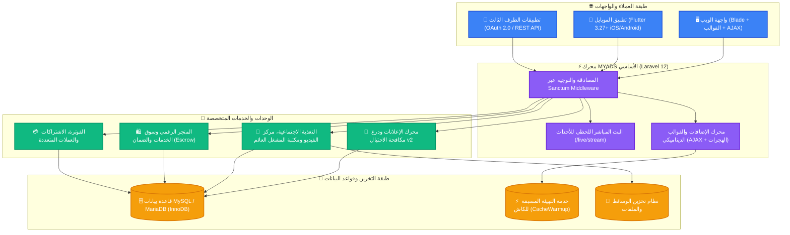

<div align="center" dir="rtl">

# 🚀 MYADS v4.5.6

### المنصة المتكاملة مفتوحة المصدر للشبكات الاجتماعية، تبادل الإعلانات والزيارات، والمتجر الرقمي

**ارتقِ بمجتمعك الرقمي مع منصة تجمع بين التفاعل الاجتماعي فائق السرعة، التبادل الإعلاني المباشر بين الأعضاء، مركز الفيديو وشورتس على طريقة يوتيوب، المتجر الرقمي متعدد البائعين، وسوق الخدمات المصغرة، مع تطبيق موبايل رسمي مبني بـ Flutter.**

مبنية ومطورة بشغف استناداً إلى **Laravel 12** و **PHP 8.2+** و **Bootstrap 5 / Flutter**.

---

[](https://github.com/mrghozzi/myads/releases)
[](https://laravel.com)
[](https://php.net)
[](https://github.com/mrghozzi/myads_app)
[](https://github.com/mrghozzi/myads/actions)
[](LICENSE)

[](https://ko-fi.com/mrghozzi)
[](https://www.patreon.com/MrGhozzi)
[](https://github.com/mrghozzi/myads/stargazers)
[](https://github.com/mrghozzi/myads/network/members)

<br/>

<a href="#-المميزات-الرئيسية"><strong>استكشاف المميزات</strong></a> •
<a href="#-التثبيت-والتشغيل-السريع"><strong>التثبيت السريع</strong></a> •
<a href="#-تطبيق-الموبايل-الرسمي-flutter"><strong>تطبيق الموبايل</strong></a> •
<a href="#-منصة-المطورين-و-rest-api"><strong>واجهة المطورين</strong></a> •
<a href="Documents/README.md"><strong>دليل التوثيق</strong></a> •
<a href="README.md"><strong>English Version</strong></a>

<br/><br/>


</div>

---

## 🌟 لماذا تختار MYADS؟

تمثل **MYADS** منظومة رقمية متكاملة للمواقع والشركات والمجتمعات على الإنترنت تغنيك عن استخدام عشرات السكربتات والخدمات المنفصلة. تجمع المنصة بين التبادل الإعلاني عالي الكفاءة، الشبكة الاجتماعية التفاعلية اللحظية، استعراض الفيديو والشورتس، التجارة الإلكترونية الرقمية، والواجهات البرمجية للمطورين في بيئة برمجية حديثة وفائقة السرعة مبنية على **Laravel 12**.

<div dir="rtl">

<table>
  <tr>
    <td width="50%">
      <h3>📢 شبكة الإعلانات والتبادل</h3>
      <p>إعلانات البنرات، الروابط النصية، تبادل الزيارات (Surf-to-earn)، تبادل مشاهدات يوتيوب، الإعلانات الذكية Smart Ads، وإعلانات الأعضاء المباشرة مع تسوية يومية بنقاط PTS وحماية متطورة من الاحتيال.</p>
    </td>
    <td width="50%">
      <h3>📺 مركز الفيديو ومقاطع الشورتس</h3>
      <p>منصة فيديو مستوحاة من YouTube مع شاشة البطل Spotlight Hero، شبكة عرض 16:9، مشغل مصغر عائم (PIP) أثناء التمرير، وشورتس رأسية 9:16 بإيماءات اللمس السلسة.</p>
    </td>
  </tr>
  <tr>
    <td width="50%">
      <h3>💬 مجتمع اجتماعي فائق التطور</h3>
      <p>تغذية منشورات محسنة تمنع بطء الاستعلامات (Zero N+1)، تدعم وسائط متعددة (فيديو، صوت، موسيقى، ملفات، ريلز)، تفاعلات، إعادة نشر، إشارات، منتديات، وبث أحداث لحظي عبر تقنية SSE.</p>
    </td>
    <td width="50%">
      <h3>📱 تطبيق الموبايل الأصلي (Flutter)</h3>
      <p>تطبيق رسمي احترافي لأنظمة أندرويد و iOS عبر (<code>myads_app</code>)، يقدم تكاملاً تاماً مع التغذية الإخبارية، عارض الشورتس، الإطارات السداسية للملفات الشخصية، ودعم 14 لغة عالمية مع RTL.</p>
    </td>
  </tr>
  <tr>
    <td width="50%">
      <h3>🛍️ المتجر الرقمي وسوق الخدمات</h3>
      <p>سوق إلكتروني متكامل لبيع وشراء البرمجيات والإضافات والقوالب بنقاط PTS أو العملات الحقيقية، مع ويكي توثيق متطور لكل منتج، وسوق متكامل للمناقصات والخدمات المصغرة.</p>
    </td>
    <td width="50%">
      <h3>⚡ لوحة تحكم الإدارة Superdesign</h3>
      <p>لوحة تحكم Duralux عصرية بنمط داكن وزجاجي، تجميع الاستعلامات في دورة واحدة (تسريع التحميل بنسبة تتجاوز 95%)، إدارة الإضافات والقوالب عبر AJAX بدون إعادة تحميل مع ترحيل الجداول تلقائياً.</p>
    </td>
  </tr>
</table>

</div>

---

## 🏗️ المخطط المعماري للنظام



---

## ✨ المميزات الرئيسية

### 📢 1. التبادل الإعلاني المتقدم ودرع مكافحة الاحتيال v2
- **إعلانات متعددة الصيغ:** بنرات قياسية (728x90, 300x250, 160x600, 468x60)، روابط نصية، بطاقات إعلانية مدمجة، وأكواد تضمين برمجية آمنة.
- **تبادل الزيارات (Surf-to-Earn):** شريط تصفح عالي السرعة مع مؤقت زمني ونظام منع التلاعب وتحويل مباشر للنقاط PTS.
- **تبادل مشاهدات يوتيوب:** زيادة عدد المشاهدات الحقيقية والتفاعل لفيديوهات الأعضاء وصناع المحتوى.
- **إعلانات الأعضاء المباشرة (`/ads/custom`):** سوق إعلاني حر بين أصحاب المواقع، توليد كود التضمين (`/embed/custom.js`)، التفاوض حول العروض، وتسوية يومية آلية لنقاط الأرباح.
- **إعلانات ذكية مع الاستهداف الجغرافي واختبارات A/B:** توجيه الحملات حسب الدولة ونوع الجهاز مع خرائط حرارية ساعية (Hourly Heatmaps) لقياس جودة النقرات.
- **درع مكافحة الاحتيال v2 (`ADS-05`):**
  - متوافق تماماً مع **معايير العرض العالمية (IAB Viewability Standard)** (مشاهدة لا تقل عن 50% من المساحة لمدة لا تقل عن ثانية مستمرة).
  - رصد وتحديد **بصمة السلوك البشري** في الوقت الفعلي (مسار وحركة الفأرة، مدة النقر باللمس، رصد المتصفحات الخفية `navigator.webdriver`، وفحوصات معالج الرسوميات WebGL).
  - تحديد معدل الطلبات (24 ساعة لكل بصمة مجهولة)، وحظر مزارع النقرات مع توثيق سبب استبعاد النقرة (`RAPID_CLICK`, `BOT_FINGERPRINT`, `HIDDEN_TAB`, `DWELL_TOO_SHORT`).

### 📺 2. مركز الفيديو وشورتس على طريقة يوتيوب
- **مركز الفيديو المستقل (`/video`):** واجهة عصرية تحتوي على بطاقة البطل المميزة (Spotlight Hero)، أزرار التصفية السريعة (`الكل`, `الفيديوهات`, `مقاطع شورتس`, `الشائع`, `الأحدث`)، وشبكة عرض بنسبة أبعاد 16:9.
- **شاشة المشاهدة المستقلة (`/t{id}`):** مشغل HTML5 متطور، ترشيحات الفيديو المقترحة، إطارات ناشرين سداسية، وقوائم سريعة منبثقة.
- **المشغل العائم المصغر (Mini PIP Player):** ينتقل الفيديو قيد التشغيل بسلاسة إلى زاوية الشاشة عند التمرير لأسفل، مع الاحتفاظ بمسار وموضع التشغيل دون انقطاع.
- **محرك مقاطع الشورتس (`/clips`):** تجربة فيديو رأسية 9:16 تدعم إيماءات السحب واللمس (`touchstart`/`touchend`)، التمرير بعجلة الفأرة، وقرص الصوت المتحرك (`messages.original_audio`).
- **مشغل الصوتيات المتصل:** شريط تشغيل عائم يظهر في أسفل الصفحة مع موجات صوتية وحفظ موضع التشغيل في `sessionStorage` أثناء تصفح صفحات الموقع.

### 💬 3. شبكة اجتماعية متكاملة ومحرك لحظي
- **تغذية إخبارية فائقة السرعة:** تحسين شامل للاستعلامات ومنع مشاكل الأداء، دعم كامل لملفات الوسائط المتعددة (فيديو، صوت، موسيقى، ألبومات صور، ملفات قابلة للتحميل، ومقاطع ريلز).
- **محركات تحرير النصوص الغنية:** إمكانية التبديل بين محرر **Quill.js v1.3.7** ومحرر **TinyMCE 7** (عبر إضافة مستقلة) مع دعم الوضع الليلي ورفع الصور مباشرة عبر AJAX.
- **بث الأحداث اللحظي بتقنية Server-Sent Events (`RT-04`):** تدفق مستمر للبيانات (`/live/stream`) لتحديث شارات الرسائل غير المقروءة، إشعارات التفاعل، ونشاط المجتمع دون الحاجة لاستنزاف بطارية الهاتف أو موارد السيرفر.
- **تفاعل متكامل:** إبداء الإعجاب، التعليقات المتداخلة، اقتباس المنشورات وإعادة نشرها، الإشارة للأعضاء `@mentions`، والوسوم `#hashtags`.
- **منتديات نقاشية متطورة:** أقسام نقاشية منظمة، مواضيع مثبتة، إغلاق المواضيع، أدوار المشرفين، وإرفاق الملفات والصور.
- **نظام الحوافز والأوسمة (Gamification):** أكثر من 25 وساماً ديناميكياً قابلاً للفتح (نجم الفيديو، سيد الشورتس، مايسترو الصوت)، تحويل مباشر للنقاط PTS، نظام كوبونات الخصم، ومهام يومية وأسبوعية متجددة.

### 🛍️ 4. المتجر الرقمي، سوق الخدمات والويكي
- **متجر المنتجات الرقمية:** نشر وبيع السكربتات والقوالب والإضافات بنقاط PTS أو بالعملات الحقيقية، مع تتبع التنزيلات والتحديثات البرمجية.
- **ويكي التوثيق المتقدم:** صفحة توثيق ومعرفة خاصة بكل منتج تدعم تنسيق Markdown، المخططات التفاعلية (Mermaid Diagrams)، الفلاتر والبحث اللحظي.
- **سوق الخدمات المصغرة:** إضافة طلبات المشاريع، استلام العروض المنظمة من مقدمي الخدمات، ترسية المشروع وتتبع التنفيذ مع نظام تقييمات موثوق بعد التسليم.
- **دليل المواقع المصنف:** دليل للأعضاء وأصحاب المواقع يعزز روابط الـ SEO الخلفية وإحصائيات الزيارات.

### 💳 5. الاشتراكات والفوترة متعددة العملات
- **خطط العضويات المدفوعة:** تخصيص الفترات، المزايا التلقائية، رصيد إعلاني مجاني، خصومات ترويجية، وأوسمة مضيئة على الملف الشخصي.
- **8 بوابات دفع مدمجة:**
  - `Stripe` • `PayPal` • `Lemon Squeezy` • `Paddle` • `التحويل البنكي` (مع رفع إيصال الدفع والمراجعة اليدوية) • `Tabby` (تقسيط) • `Flouci` • ومحاكي `Apple Pay`.
- **نظام العملات المتعددة:** عملة أساسية مع تحويل تلقائي حسب أسعار الصرف، وتحكم في عدد الخانات العشرية.
- **أمان مطلق للبيانات:** لا يتم تخزين أية بيانات بطاقات ائتمانية على السيرفر المحلي؛ تتم جميع المدفوعات عبر بوابات مشفرة ومعتمدة عالمياً.

### 🛠️ 6. منصة المطورين والواجهة البرمجية OAuth 2.0
- **سيرفر OAuth 2.0 المتكامل (`/oauth/authorize`, `/oauth/token`):** مطابقة كاملة للمعيار العالمي RFC 6749، دعم معاملات الاستعلام في روابط التوجيه، والمصادقة عبر HTTP Basic Auth.
- **كتالوج تصاريح مفصل:** 27 تصريحاً (Scope) مقسمة على 7 فئات أمنية تشمل الهوية، المحتوى، الرسائل، المحفظة، المجتمع، والمتجر.
- **واجهة REST API v1 للمطورين (`/api/developer/v1/*`):** نقاط وصول برمجية لنشر المحتوى وإدارته برمجياً وجلب الملف الشخصي والمنتجات.
- **توافق مع بيئات السيرفرات المختلفة:** استخراج مرن للـ Bearer Token يعمل بكفاءة مع أباتشي و FastCGI و cPanel والبروكسي العكسي و Cloudflare.
- **جاهزية التكامل مع ووردبريس:** مهيأ للتكامل التلقائي مع إضافات النشر الآلي مثل إضافة ADStn Auto Poster.

### 🎛️ 7. لوحة تحكم الإدارة الفائقة Duralux Superdesign
- **واجهة عصرية بنمط داكن وزجاجي (`/admin`):** تجميع الاستعلامات في استعلام واحد مما **خفض زمن التحميل بنسبة تفوق 95%**.
- **محرك نصائح الإدارة اليومية:** نصيحة متجددة يومياً تظهر للمدير لتقديم إرشادات لتطوير وحماية المنصة.
- **مركز الإضافات والقوالب بتقنية AJAX:** تفعيل وتعطيل الإضافات والقوالب فورياً بدون إعادة تحميل الصفحة، مع عدادات وفلاتر تصنيف حية.
- **التنفيذ التلقائي لترحيلات قواعد البيانات:** تشغيل هجرات الجداول تلقائياً بمجرد تفعيل الإضافة أو ترقيتها دون الحاجة للدخول لصفحات الصيانة يدوياً.
- **مخصص القوالب اللحظي (`THEME-07`):** تخصيص الألوان الأساسية، الخطوط (كايرو، تجوال، إنتر، روبوتو)، حواف العناصر، والتأثير الزجاجي مع معاينة مباشرة للشاشات المختلفة (حاسوب، تابلت، جوال).
- **فحص صحة وأداء النظام:** رصد مساحات الجداول، تحسين الفهارس التالفة بنقرة واحدة (`OPTIMIZE TABLE`)، وفحص موارد الإضافات النشطة.

---

## 📱 تطبيق الموبايل الرسمي (Flutter)

تقدم المنصة تطبيق موبايل رسمي مفتوح المصدر تم بناؤه باستخدام إطار العمل الحديث **Flutter 3.27+** ليعمل بكفاءة على نظامي أندرويد و iOS.

<div align="center">
  <a href="https://github.com/mrghozzi/myads_app">
    
  </a>
</div>

### مميزات تطبيق الموبايل:
- **تطابق كامل مع تغذية الويب:** فيديوهات 16:9، مشغل شورتس رأسي، بطاقات الصوت بموجات متحركة، معارض الصور، وتنزيل الملفات.
- **شاشة مركز الفيديو المخصصة:** واجهة مستوحاة من تطبيق YouTube مع فلاتر التصنيف وبانر الفيديو المميز ورف مقاطع الشورتس.
- **الملفات الشخصية السداسية الفاخرة:** إطارات سداسية تعكس رتبة العضو أو باقة الاشتراك بألوان مميزة (ذهبي، ماسي) وأوسمة الإنجازات.
- **الأمان والخصوصية:** حفظ التوكنز مشفرة داخل شريحة الأمان بالهاتف عبر (`flutter_secure_storage`)، وتشفير الاتصال الكامل بـ HTTPS ومنع تخمين أرقام العضويات.
- **دعم كامل للغة العربية:** واجهات مصممة خصيصاً للاتجاه من اليمين إلى اليسار (RTL) وتغيير اللغة التلقائي وفق إعدادات الجهاز.

> 📖 يمكنك مراجعة [دليل تطبيق الموبايل](Documents/MOBILE_APP_GUIDE.md) والاطلاع على [مستودع الكود المصدري](https://github.com/mrghozzi/myads_app).

---

## 💻 البنية التقنية (Technology Stack)

| الطبقة | التقنية المستخدمة |
| :--- | :--- |
| **إطار عمل الخلفية (Backend)** | [Laravel 12.x](https://laravel.com/) |
| **بيئة تشغيل PHP** | PHP 8.2 أو أحدث (متوافق مع PHP 8.3 و 8.4) |
| **محرك قواعد البيانات** | MySQL 5.7+ / 8.0+ أو MariaDB 10.3+ (محرك InnoDB) |
| **واجهة الويب (Frontend)** | قوالب Blade، Bootstrap 5، وجافاسكريبت نقية (بدون أعباء SPA) |
| **تطبيق الهاتف الذكي** | [Flutter 3.27+](https://flutter.dev/) / Dart (Riverpod, Dio, SecureStorage) |
| **البث المباشر للأحداث** | Server-Sent Events (SSE) عبر خدمة `LiveEventStreamService` |
| **المصادقة والـ API** | Laravel Sanctum للموبايل، بروتوكول OAuth 2.0 للمطورين، و Socialite |
| **حزمة الاختبارات الآلية** | PHPUnit 11 (اختبارات وظيفية ووحدوية شاملة) |
| **اللغات المدعومة** | 14 لغة عالمية (`ar`, `en`, `fr`, `es`, `de`, `it`, `pt`, `ru`, `sr`, `tr`, `ja`, `zh_CN`, `zh_TW`, `fa`) مع دعم RTL الكامل |

---

## ⚡ التثبيت والتشغيل السريع

### المتطلبات الأساسية
تأكد من توفر المتطلبات التالية على خادمك قبل التثبيت:
- **PHP:** إصدار `^8.2` مع الحزم التالية: `BCMath`, `Ctype`, `cURL`, `DOM`, `Fileinfo`, `JSON`, `Mbstring`, `OpenSSL`, `PCRE`, `PDO MySQL`, `Tokenizer`, `XML`.
- **قاعدة البيانات:** MySQL 5.7+ أو MariaDB 10.3+.
- **الأدوات:** Composer 2.x و Node.js 18+ (لتجميع ملفات الواجهة محلياً).

### 1. التثبيت السريع عبر مثبت الويب (Web Installer)

1. **استنساخ أو تحميل المشروع:**
   ```bash
   git clone https://github.com/mrghozzi/myads.git
   cd myads
   ```

2. **تثبيت حزم PHP والواجهة:**
   ```bash
   composer install --optimize-autoloader --no-dev
   npm install && npm run build
   ```

3. **إعداد مسار الخادم:**
   - قم بتوجيه مسار النطاق (Document Root) إلى مجلد `public/`.
   - في حال استخدام استضافة مشتركة على أباتشي، سيتولى ملف `.htaccess` المرفق في المسار الرئيسي عملية التوجيه تلقائياً.

4. **تشغيل معالج التثبيت المرئي:**
   افتح المتصفح وانتقل إلى الرابط التالي:
   ```text
   http://your-domain.com/install
   ```
   اتبع خطوات المعالج المكونة من 5 مراحل للتحقق من أذونات المجلدات، ربط قاعدة البيانات، إنشاء مفتاح التشفير، تنفيذ الهجرات، وإنشاء حساب المدير العام.

---

### 2. التثبيت اليدوي للمطورين عبر سطر الأوامر (CLI)

```bash
# 1. استنساخ المستودع
git clone https://github.com/mrghozzi/myads.git && cd myads

# 2. تثبيت الحزم البرمجية
composer install
npm install

# 3. إعداد ملف البيئة
cp .env.example .env
php artisan key:generate

# 4. قم بإدخال بيانات الاتصال بقاعدة البيانات في ملف .env ثم شغل الهجرات:
php artisan migrate --force

# 5. بناء ملفات الواجهة وتشغيل السيرفر التجريبي:
npm run build
php artisan serve
```

أصبح موقعك الآن جاهزاً ويعمل محلياً على الرابط: `http://127.0.0.1:8000`! 🎉

---

## 🔌 منصة المطورين و REST API

تحتوي المنصة على منظومة برمجية متكاملة لربط التطبيقات الخارجية وسيرفر OAuth 2.0 للمصادقة.

### مثال: نشر تدوينة جديدة في المجتمع عبر REST API
```bash
curl -X POST "https://your-domain.com/api/developer/v1/me/content" \
     -H "Authorization: Bearer YOUR_ACCESS_TOKEN" \
     -H "Content-Type: application/json" \
     -H "Accept: application/json" \
     -d '{
       "content": "سعداء جداً بإطلاق منصتنا الجديدة عبر MYADS! 🚀 #ابتكار",
       "media_type": "text",
       "privacy": "public"
     }'
```

### لمحة عن التصاريح (Scopes) المدعومة:
- `user.identity.read` • `user.profile.read` • `user.profile.write`
- `user.content.read` • `user.content.write` (مع الأسماء البديلة `content.write` و `posts.write`)
- `user.messages.read` • `user.messages.send`
- `user.wallet.read` • `user.community.read` • `store.products.read`

> 📖 للمزيد من التفاصيل حول جميع نقاط الوصول البرمجية وأمثلة الاستدعاء، راجع [توثيق الـ API الشامل](Documents/API_DOCS.md).

---

## 📚 فهرس التوثيق الشامل

تتوفر أدلة تفصيلية متخصصة لكل قسم داخل مجلد التوثيق [`Documents/`](Documents/):

| الدليل | الوصف |
| :--- | :--- |
| 📖 [**دليل المنصة الشامل**](Documents/README.md) | شرح وافٍ لمعمارية النظام وجميع وحداته ووظائفه. |
| ⚙️ [**دليل التثبيت والإعداد**](Documents/INSTALLATION.md) | شرح التثبيت على سيرفرات أباتشي، إنجنكس، و cPanel خطوة بخطوة. |
| 📋 [**متطلبات النظام**](Documents/SYSTEM_REQUIREMENTS.md) | القائمة الكاملة لإضافات PHP وإعدادات السيرفر الموصى بها. |
| 🎨 [**دليل تطوير القوالب**](Documents/THEME_GUIDE.md) | كيفية إنشاء قوالب جديدة والربط مع مخصص القوالب اللحظي. |
| 🔌 [**دليل برمجة الإضافات**](Documents/PLUGIN_GUIDE.md) | كيفية بناء إضافات مخصصة وتسجيل الخطافات والودجات البرمجية. |
| 📱 [**دليل تطبيق الموبايل**](Documents/MOBILE_APP_GUIDE.md) | كيفية بناء وتوصيل تطبيق فلاتر (`myads_app`) مع موقعك. |
| 💳 [**دليل الاشتراكات والفوترة**](Documents/PAID_SUBSCRIPTIONS_GUIDE.md) | إعداد خطط العضويات وربط بوابات الدفع والـ Webhooks. |
| 📡 [**توثيق الـ REST API**](Documents/API_DOCS.md) | مواصفات واجهة برمجة التطبيقات للمطورين وتطبيق الموبايل. |
| 🚀 [**دليل الترقية والتحديث**](Documents/UPGRADE.md) | إجراءات ترقية النظام وتحديث جداول قاعدة البيانات بأمان تام. |
| 📜 [**سجل التغييرات والتحديثات**](Documents/changelogs.md) | تاريخ كافة الإصدارات والتحسينات الأمنية والتطويرات. |

---

## 🤝 المساهمة والمجتمع البرمجي

نرحب بشدة بجميع المساهمات والأفكار والتطويرات البرمجية من مجتمع المطورين!

1. **قم بعمل Fork للمشروع**
2. **أنشئ فرعاً لتطويرك** (`git checkout -b feature/AmazingFeature`)
3. **احفظ التعديلات** (`git commit -m 'Add some AmazingFeature'`)
4. **ارفع التعديل إلى فرعك** (`git push origin feature/AmazingFeature`)
5. **افتح طلب سحب (Pull Request)**

يرجى مراجعة [إرشادات المساهمة](CONTRIBUTING.md)، [ميثاق السلوك الأخلاقي](CODE_OF_CONDUCT.md)، و [سياسة الأمان](SECURITY.md).

---

## ⭐ تاريخ النجوم ودعم المشروع

إذا نالت منصة **MYADS** إعجابك أو ساعدتك في تطوير مشاريعك، **يرجى دعم المشروع بنجمة (Star) على جيت هاب!** ⭐  
دعمكم هو الحافز الأكبر لمواصلة التطوير وتقديم تحديثات مستمرة للمجتمع مفتوح المصدر.

<div align="center">
  <a href="https://github.com/mrghozzi/myads/stargazers">
    
  </a>
</div>

---

## 💖 الرعاية والدعم المالي

منصة **MYADS** برمجية مجانية ومفتوحة المصدر يتم تطويرها وصيانتها بواسطة **[mrghozzi](https://github.com/mrghozzi)**. إذا كانت المنصة تقدم قيمة مضافة لأعمالك أو موقعك، يمكنك دعم استمرارية التطوير عبر:

<div align="center">

[](https://ko-fi.com/mrghozzi)
&nbsp;&nbsp;&nbsp;&nbsp;
[](https://www.patreon.com/MrGhozzi)

</div>

---

## 📄 الترخيص

تخضع منصة **MYADS** لشروط **[ترخيص MIT](LICENSE)**. يحق لك استخدامها وتعديلها وإعادة توزيعها مجاناً للأغراض الشخصية والتجارية.

<div align="center">
  <sub>صُنعت بكل حب ❤️ بواسطة <a href="https://github.com/mrghozzi">mrghozzi</a> والمجتمع مفتوح المصدر.</sub>
</div>
